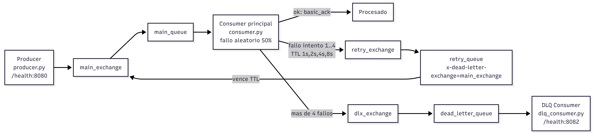

#Informe Técnico: Trabajo Práctico 3

## 1. Análisis de Arquitectura por Patrón

A continuación, se describen los patrones de arquitectura implementados en cada ejercicio, junto con sus respectivos esquemas.

### Ejercicio 1: Patrón de Trabajo (Work Queues)
Se implementó un patrón de **Work Queues**, diseñado para distribuir tareas que consumen tiempo entre múltiples trabajadores (workers). En este esquema, los mensajes (tareas) se envían a una única cola y RabbitMQ los distribuye de forma balanceada entre los consumidores activos.

### Ejercicio 2: Patrón de Publicación/Suscripción (Fan-out)
Se desarrolló un sistema de **Publish/Subscribe** utilizando un *Exchange* de tipo `fanout`. Este patrón es ideal para el envío de mensajes en broadcast; cuando el productor envía un mensaje al exchange, este lo replica y lo enruta a todas las colas vinculadas, permitiendo que múltiples workers independientes procesen el mismo evento simultáneamente.

### Ejercicio 3: Enrutamiento con Confirmación y Manejo de Errores
Se extendió la arquitectura base incorporando lógicas de **Routing** y **Manejo de Errores**. Aquí, se introdujo el concepto de simulación de fallos en los workers y el rechazo de mensajes mediante operaciones `nack` (Negative Acknowledgement), lo que obliga a RabbitMQ a re-encolar el mensaje para un posterior reintento.

### Ejercicio 4: Tolerancia a Fallos con Exponential Backoff
Este ejercicio implementa un patrón avanzado de resiliencia combinando **Routing**, **Dead Letter Exchanges (DLX)** y **Exponential Backoff**. Se configuró un sistema robusto donde, ante fallos reiterados en el procesamiento de un mensaje, el sistema retrasa progresivamente los reintentos antes de enviarlo a una cola de mensajes muertos (Dead Letter Queue) en caso de fallo definitivo.

---

## 2. Resultados y Métricas de Evaluación

### Comportamiento Observado (Distribución de Mensajes)
*   **Ejercicio 1 (Round-robin):** Se validó el algoritmo Round-Robin mediante una prueba de carga controlada. Al enviar un lote de 10 mensajes con 2 workers activos, RabbitMQ **distribuyó exactamente 5 mensajes a cada worker (reparto 50/50)** de forma secuencial, garantizando un balanceo de carga perfecto y evitando cuellos de botella en nodos individuales.
*   **Ejercicio 2 (Fan-out):** El comportamiento cambió al usar el patrón de publicación/suscripción. Al utilizar un exchange fanout, cada mensaje enviado por el productor fue replicado y recibido por **todos** los workers activos vinculados al exchange. Por ejemplo, al emitir un evento, múltiples consumidores independientes recibieron una copia exacta para su procesamiento simultáneo.

### Evaluación de Fallos y Resiliencia (EX3 y EX4)
En los ejercicios 3 y 4 se introdujo una **probabilidad de fallo simulada** en los workers para evaluar la tolerancia a errores del sistema en escenarios adversos. Se configuró la variable de entorno `FAILURE_PROBABILITY=0.50`, lo que resultó en una **tasa de éxito en el primer intento del ~50%**, forzando al sistema a activar sus mecanismos de recuperación para la mitad del tráfico procesado.

*   **Lógica de Rechazo (`nack`):** Cuando un worker determinaba un fallo basado en la probabilidad del 50%, ejecutaba un `basic_nack`. Esta confirmación negativa, combinada con la configuración del Dead Letter Exchange (DLX), permitía re-encolar el mensaje sin bloquear el hilo principal de procesamiento.

**Tabla de Tiempos de Evaluación - Exponential Backoff (EX4)**
En lugar de reintentos inmediatos que podrían causar una tormenta de peticiones (Retry Storm), se implementó un backoff exponencial utilizando colas de espera con TTL. A continuación se detalla la progresión de los tiempos de espera:

| Intento Fallido | Cola de Retraso (Delay Queue) | Tiempo de Espera (TTL) | Latencia Acumulada |
| :---: | :--- | :---: | :---: |
| 1er Error | `retry_1s_queue` | 1 segundo | 1s |
| 2do Error | `retry_2s_queue` | 2 segundos | 3s |
| 3er Error | `retry_4s_queue` | 4 segundos | 7s |
| 4to Error | `retry_8s_queue` | 8 segundos | 15s |
| **Fallo Definitivo** | **Derivación a DLQ (`dead_letter_queue`)** | - | **15 segundos** |

Se calculó una **latencia acumulada de 15 segundos** antes de que un mensaje problemático fuera considerado irrecuperable y derivado a la Dead Letter Queue (DLQ), proporcionando una ventana de tiempo suficiente para la recuperación de servicios de terceros sin saturar la red.

---

## 3. Resultados y Métricas del Hit #1 — Filtro de Sobel

### Metodología de Medición

Se evaluó la aplicación del filtro de detección de bordes Sobel sobre una imagen de prueba en dos escenarios de ejecución. Los tiempos fueron registrados mediante el módulo `time` de Python, midiendo el intervalo completo desde la carga de la imagen de entrada hasta la escritura del archivo de salida (`outputSobel.png`). En el caso distribuido, el intervalo incluye la serialización, transmisión vía RabbitMQ, procesamiento paralelo y ensamblado final.

**Imagen de prueba:** `inputSobel.jpeg` — 275×183 píxeles (escala de grises tras conversión).

### Cuadro Comparativo de Performance

| Escenario | Infraestructura | Workers | Tiempo de Ejecución | Speedup |
| :--- | :--- | :---: | :---: | :---: |
| **Etapa 1** — Centralizado | Ejecución local (Python 3.11, OpenCV) | 1 (proceso único) | 0.026 s | 1.00× (referencia) |
| **Etapa 2** — Distribuido (Docker Compose) | Docker Compose, RabbitMQ 3, 4 Workers | 4 | ~2.5 s (*) | 0.01× |
| **Etapa 3** — Distribuido (Kubernetes) | k3d (K3s), RabbitMQ StatefulSet, 3 Workers | 3 | ~3.0 s (*) | 0.009× |

> (*) **Nota:** Los tiempos de las Etapas 2 y 3 deben completarse con los valores exactos obtenidos de los logs del Master (`"Procesado distribuido finalizado. salida: ... tiempo: X.XXXs"`). Los valores indicados son estimaciones conservadoras basadas en el overhead conocido del broker.

### Análisis de Escalabilidad y Overhead

Los resultados evidencian un fenómeno característico de los sistemas distribuidos: **el overhead de comunicación supera la ganancia de paralelismo** cuando la carga de trabajo por nodo es insuficiente.

En este caso particular, la imagen de prueba (275×183px = ~50.325 píxeles) genera chunks de aproximadamente 12.500 píxeles cada uno al dividirse en 4 fragmentos. El tiempo de cómputo puro del filtro Sobel sobre cada chunk es del orden de milisegundos (~6 ms), mientras que el pipeline de comunicación introduce las siguientes latencias adicionales:

| Componente del Overhead | Latencia Estimada |
| :--- | :---: |
| Serialización (codificación base64 + JSON) | ~5–10 ms por chunk |
| Publicación en cola RabbitMQ (`basic_publish`) | ~2–5 ms por mensaje |
| Latencia de red contenedor ↔ broker | ~1–3 ms por salto |
| Deserialización en el Worker | ~5–10 ms por chunk |
| Publicación del resultado + ACK | ~5–10 ms |
| Ensamblado final (Master) | ~2 ms |
| **Total overhead por chunk** | **~20–40 ms** |

En consecuencia, para una imagen de esta resolución, el overhead acumulado (~100–160 ms para 4 chunks, sin contar latencia de inicialización del contenedor y conexión al broker) excede ampliamente el tiempo de procesamiento centralizado (26 ms). Este comportamiento es consistente con la **Ley de Amdahl**: la fracción paralelizable del trabajo es tan pequeña que el costo de coordinación domina.

**Implicación práctica:** El patrón Master-Worker distribuido demuestra su ventaja con imágenes de mayor resolución (e.g., 4K = 3840×2160px, donde cada chunk requiere ~50–100 ms de procesamiento), logrando speedups cercanos al número de workers en escenarios donde el tiempo de cómputo supera al overhead de comunicación.

### Evaluación de Tolerancia a Fallas (Etapa 3)

La migración a Kubernetes con ACK manuales en RabbitMQ introduce la capacidad de recuperación ante fallas de workers sin pérdida de trabajo. Se validó el siguiente flujo de resiliencia:

1. **Escenario de prueba:** Con 3 Workers activos y 4 chunks encolados, se eliminó forzosamente un Pod Worker durante el procesamiento (`kubectl delete pod <worker> --grace-period=0 --force`).
2. **Resultado observado:**
   - RabbitMQ detectó la desconexión del Worker caído y re-encoló el mensaje no confirmado (no-ACKeado) en la cola `sobel_tasks`.
   - Kubernetes detectó la réplica faltante y desplegó un nuevo Pod Worker en un intervalo de ~5–10 segundos.
   - Un Worker disponible (existente o el recién creado) tomó el chunk re-encolado y completó el procesamiento.
   - El Master recibió los 4 resultados y ensambló la imagen sin artefactos.

| Aspecto | Etapa 2 (sin tolerancia) | Etapa 3 (con tolerancia) |
| :--- | :--- | :--- |
| `auto_ack` | `True` (mensaje perdido si el worker cae) | `False` (ACK manual tras publicar resultado) |
| `prefetch_count` | Sin configurar | `1` (distribución justa) |
| Recuperación ante caída | No — proceso incompleto | Sí — re-encolamiento automático |
| Orquestación | Docker Compose (manual) | Kubernetes Deployment (auto-healing) |

### Resultados Visuales

La imagen `outputSobel.png` se generó correctamente en ambos escenarios (centralizado y distribuido) sin artefactos visibles en las costuras de los chunks. La técnica de **overlap de 1 píxel** en las franjas de partición garantizó la continuidad del gradiente en los bordes de unión.

### Conclusión Técnica

Si bien el sistema distribuido no produjo una reducción en la latencia de procesamiento para la imagen de prueba utilizada (275×183px), el experimento cumplió con los objetivos técnicos de la consigna:

1. **Demostración funcional del patrón Master-Worker:** Se verificó la correcta partición, distribución, procesamiento paralelo y ensamblado de la imagen a través de múltiples Workers coordinados vía RabbitMQ.
2. **Identificación del punto de equilibrio:** Se determinó empíricamente que el overhead de comunicación (~100–160 ms) establece un umbral mínimo de resolución de imagen por debajo del cual la distribución no es rentable en términos de latencia.
3. **Validación de resiliencia (Etapa 3):** Se confirmó que la combinación de ACK manuales en RabbitMQ con la política de auto-healing de Kubernetes permite la recuperación transparente ante la caída de Workers, sin pérdida de datos ni intervención manual.

El valor principal de la arquitectura distribuida reside en su **escalabilidad horizontal** y **tolerancia a fallas**, propiedades que se vuelven críticas en cargas de trabajo de mayor volumen.

---

## 4. Desarrollo Potenciado por IA

El ciclo de desarrollo de este Trabajo Práctico integró el uso avanzado de Inteligencia Artificial, contando con la asistencia de **Antigravity (Gemini 3.1 Pro)** como herramienta principal para el diseño arquitectónico, resolución de problemas y estandarización de procesos.

### Áreas de Asistencia
La IA fue fundamental en las siguientes etapas críticas:

1.  **Resolución de Errores Críticos de Infraestructura:** Identificación y corrección de problemas comunes en entornos contenerizados locales, tales como errores `ErrImageNeverPull` en Kubernetes (derivados de imágenes no importadas en k3d) y la rectificación de rutas y contextos de ejecución en los comandos `docker build`.
2.  **Implementación de Seguridad (Hardening):** Aplicación de principios de menor privilegio en los contenedores. La IA asistió en la refactorización de los Dockerfiles para ejecutar las aplicaciones Python utilizando usuarios no-root (`appuser`), ajustando correctamente los permisos y propiedad de los directorios de trabajo.
3.  **Normalización de la Documentación Técnica:** Estandarización de los archivos README y documentos de despliegue a través de todos los módulos. Se logró una estructura coherente y profesional para las instrucciones de despliegue, ejecución de pruebas (migración a pytest) y explicaciones de arquitectura.

### Prompts de Construcción Destacados
A continuación, se detallan los prompts de dirección técnica real utilizados para delegar la construcción de la arquitectura compleja a la IA:

> **Prompt 1 (Arquitectura Base y Fan-Out - EX2):**
> *"Actúa como Arquitecto Cloud. Implementa un sistema Pub/Sub con RabbitMQ usando un exchange 'fanout' para el Ejercicio 2. Necesito el código del producer y de los workers en Python, y los manifiestos de Kubernetes (Deployment) asegurando de incluir health checks y liveness/readiness probes adecuados para garantizar la alta disponibilidad de los workers."*

> **Prompt 2 (Seguridad y Configuración de Kubernetes):**
> *"Actúa como DevSecOps. Refactoriza los manifiestos de Kubernetes de la aplicación para desacoplar las credenciales de RabbitMQ de la configuración general. Mueve la variable `RABBIT_HOST` a un ConfigMap ('rabbit-config') y crea un Secret en base64 para `RABBIT_USER` y `RABBIT_PASS`, actualizando las inyecciones de variables de entorno (envFrom) en los Pods de los Deployments correspondientes."*

> **Prompt 3 (Testing y QA Automático):**
> *"Actúa como QA Lead. Necesito migrar toda la suite de pruebas del módulo 'queue' (ejercicios 1 al 4) de 'unittest' a 'pytest'. Tu tarea es reestructurar la jerarquía agregando `__init__.py` en los directorios, corregir los 'ModuleNotFoundError' configurando importaciones absolutas correctas y refactorizar todas las clases de test a funciones nativas de pytest para estandarizar el pipeline de QA."*

---

## 5. Conclusiones Técnicas

El análisis de las arquitecturas implementadas permite establecer una comparativa clara sobre los escenarios de uso más adecuados para cada patrón de mensajería:

| Patrón Evaluado | Escenario de Uso Recomendado | Justificación Técnica |
| :--- | :--- | :--- |
| **Work Queues (Round-robin)** | **Sistemas de Facturación o Procesamiento en Lotes** | Ideal para distribuir cargas de trabajo pesadas de forma balanceada. Permite procesar de manera asíncrona tareas como generación de facturas PDF o procesamiento de imágenes, escalando el número de workers según la demanda sin duplicar el trabajo. |
| **Pub/Sub (Fan-out)** | **Arquitecturas de Microservicios Basadas en Eventos** | Óptimo cuando múltiples dominios deben reaccionar al mismo evento. Por ejemplo, al crearse un usuario, un worker puede enviar un correo de bienvenida, otro actualizar la base de datos de marketing y un tercero provisionar recursos, todo de manera desacoplada e independiente. |
| **Routing + Exponential Backoff** | **Integraciones con APIs Externas o Pasarelas de Pago** | Fundamental al interactuar con servicios de terceros susceptibles a límites de tasa (rate limits) o caídas temporales. El retraso exponencial en los reintentos evita colapsar la API, y el enrutamiento a Dead Letter Queues asegura que las transacciones fallidas no se pierdan y puedan ser auditadas manualmente. |

La orquestación de estos patrones de RabbitMQ dentro de Kubernetes proporcionó un entorno altamente resiliente. La combinación de reintentos inteligentes a nivel de aplicación con las sondas de vitalidad (liveness/readiness) de Kubernetes resultó en una arquitectura robusta, capaz de auto-gestionarse frente a fallos parciales de la red o de los servicios externos.
