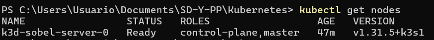
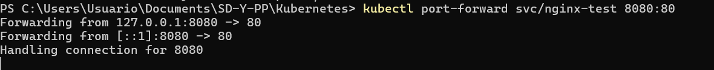
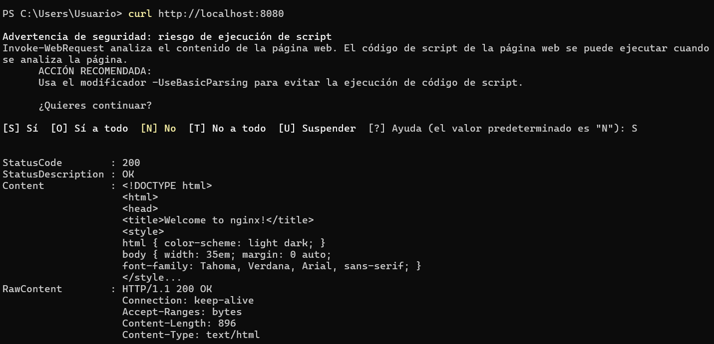
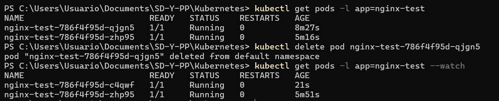
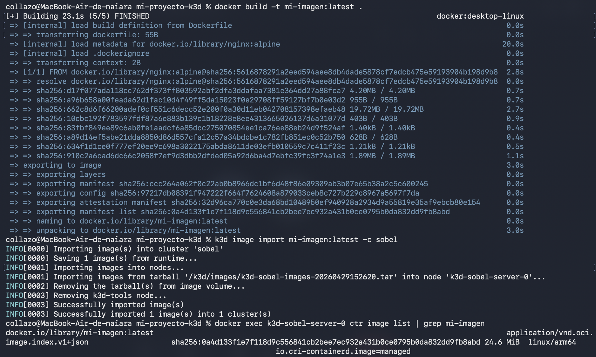

# Entrega Hit #1 - Prerrequisitos cumplidos

A continuación, se presenta la evidencia técnica correspondiente a los cinco puntos requeridos para la validación del Hit #1.

### 1. Estado de los Nodos (`kubectl get nodes`)
Al ejecutar el comando, se confirma que el nodo del cluster se encuentra en estado **Ready**.

* **Evidencia:** 

### 2. Despliegue de nginx-test (replicas: 2)
Se desplegó exitosamente el servicio `nginx-test` con dos réplicas funcionales, verificando el acceso mediante `curl localhost:8080`.

* **Evidencia:** 

### 3. Autoreparación del Deployment
Se verificó la capacidad de recuperación del sistema eliminando un Pod manualmente y observando cómo el Deployment lo recrea de forma automática para mantener el estado deseado.

* **Evidencia:** 

### 4. Importación de imágenes Docker
Se domina el flujo de trabajo para importar imágenes locales al entorno de ejecución del cluster (`k3d image import` / `k3s ctr images import`).

* **Evidencia:** 

### 5. Conceptos base de Kubernetes
Se comprenden las funciones de los siguientes objetos:
* **Pod:** La unidad mínima de ejecución que aloja los contenedores.
* **Deployment:** Gestiona el ciclo de vida y el escalado de los Pods de forma declarativa.
* **Service:** Expone la aplicación a la red y balancea el tráfico entre las réplicas.
* **ConfigMap:** Almacena variables de configuración no sensibles.
* **Secret:** Gestiona datos sensibles como claves o credenciales de forma segura.