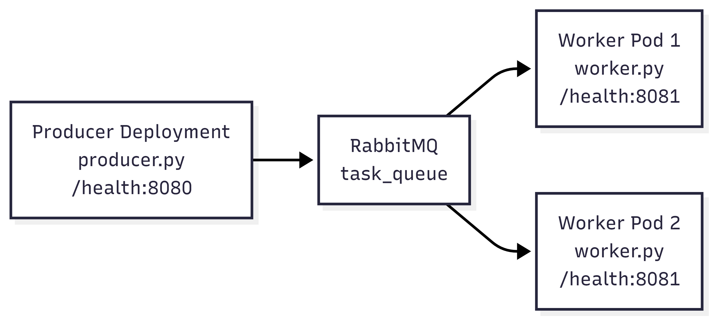

# Ejemplo 1 - Work Queue con RabbitMQ

Este ejemplo implementa el patron **Work Queue** o **Maestro/Esclavo**. Un productor publica 10 tareas en la cola `task_queue` y uno o mas workers las consumen. Al escalar el Deployment de workers a 2 replicas se puede observar el reparto round-robin de RabbitMQ.

## Arquitectura
La solución se despliega en un cluster de Kubernetes (K3s local) y aplica el patrón de Work Queue (Cola de Trabajo) para la distribución de tareas. Consta de los siguientes componentes:  
- RabbitMQ: Broker de mensajería que actúa como intermediario, gestionando la cola persistente task_queue.  
- Producer: Un pod encargado de generar y enviar 10 tareas numeradas de forma secuencial a la cola.  
- Workers (Consumidores): Un Deployment que puede escalarse dinámicamente. Cada réplica representa un consumidor que recibe, procesa e imprime las tareas.

## Patrón de Distribución Round-Robin
El funcionamiento de la arquitectura se basa en la competencia entre consumidores para optimizar el procesamiento:  
- Gestión de Cola Única: El sistema opera sobre una única cola (task_queue) donde los mensajes permanecen almacenados hasta que un trabajador está disponible para procesarlos.  
- Reparto Equitativo: RabbitMQ implementa un algoritmo de Round-Robin para la entrega de mensajes. Esto significa que, cuando existen múltiples instancias de workers, el broker distribuye las tareas de manera cíclica entre ellos.  
- Procesamiento Exclusivo: Cada mensaje es procesado por exactamente un consumidor. Una vez que un worker toma una tarea, esta ya no está disponible para los demás, evitando la duplicidad de esfuerzos.  
- Escalabilidad Horizontal: Al aumentar el número de réplicas del worker (por ejemplo, a 2 o más), el sistema distribuye automáticamente la carga entre los nuevos recursos disponibles, permitiendo observar cómo RabbitMQ reparte los mensajes de forma balanceada.  

## Diagrama de Arquitectura



## Paso a paso de ejecucion

Situarse en la raiz del ejemplo:

```bash
cd TrabajoPractico3/queue/ex1/
```

Construir la imagen unica para producer y worker:

```bash
docker build -f Dockerfile -t app-ex1:latest .
```

Importar la imagen local al cluster k3d `sobel`:

```bash
k3d image import app-ex1:latest -c sobel
```

Desplegar RabbitMQ, producer y worker:

```bash
kubectl apply -f k3s/
```

Verificar Pods:

```bash
kubectl get pods
```

Ver logs del productor:

```bash
kubectl logs -f deployment/producer-deployment
```

Ver logs del worker:

```bash
kubectl logs -f deployment/worker-deployment
```

## Escalar y observar round-robin

Escalar el worker a 2 replicas:

```bash
kubectl scale deployment worker-deployment --replicas=2
```

Ver logs de todos los workers:

```bash
kubectl logs -f -l app=worker --prefix=true
```

Si el producer ya envio las 10 tareas antes de escalar, reiniciarlo para generar otra tanda:

```bash
kubectl rollout restart deployment/producer-deployment
```

Con 2 workers se espera observar que algunas tareas las procesa un Pod y otras tareas el otro. RabbitMQ entrega cada mensaje a un solo consumidor y reparte los mensajes entre los consumidores disponibles.

## Health-checks

El producer expone:

```text
GET /health en puerto 8080
```

El worker expone:

```text
GET /health en puerto 8081
```

Ambos devuelven:

```json
{"servicio": "status"}
```

## Variables de entorno

Ver [.env.example](.env.example).

```bash
RABBITMQ_USER=tp3
RABBITMQ_PASS=tp3
RABBIT_HOST=rabbitmq
RABBITMQ_PORT=5672
QUEUE_NAME=task_queue
```

En Kubernetes, usuario y password se configuran mediante `Secret`. La configuracion externa de la aplicacion se maneja con el `ConfigMap` `rabbitmq-config`, definido en `k3s/rabbitmq.yaml`:

```yaml
data:
  RABBIT_HOST: rabbitmq
  RABBITMQ_PORT: "5672"
  QUEUE_NAME: task_queue
```

El producer y el worker leen `RABBIT_HOST` para conectarse al Service de RabbitMQ y `QUEUE_NAME` para declarar y consumir la cola.

## Logging

Los procesos escriben logs en:

- STDOUT, visible con `kubectl logs`.
- Archivo rotativo en disco:
  - Producer: `/var/log/ex1/producer.log`
  - Worker: `/var/log/ex1/worker.log`

## Tests

Ejecutar desde esta carpeta:

```bash
pytest
```

## Limpieza

```bash
kubectl delete -f k3s/
```
