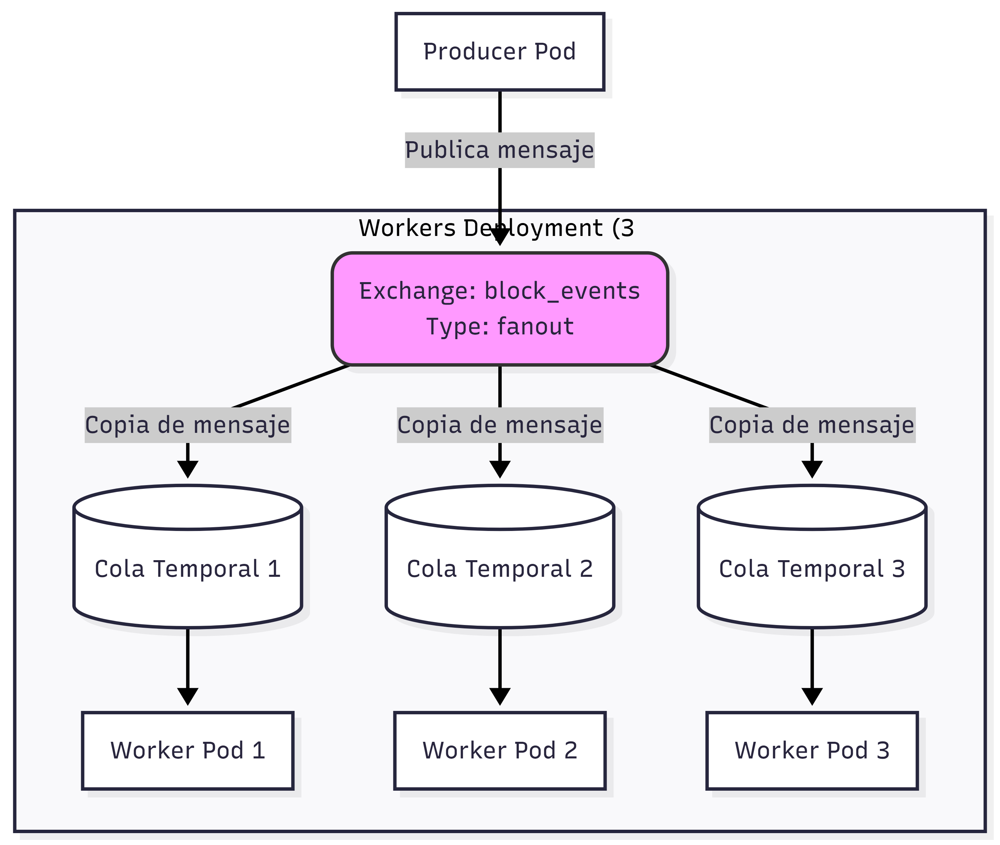

# Trabajo Práctico 3 - Hit #0 (Ejemplo 2): Patrón Pub-Sub (Fan-out)

Este proyecto implementa el patrón de diseño Event Bus / Pub-Sub utilizando RabbitMQ. En este escenario, simulamos un productor de bloques minados que emite notificaciones a múltiples nodos (workers) de la red.

## Arquitectura

La solución se despliega en un cluster de Kubernetes (K3s local) y consta de los siguientes componentes:
1. **RabbitMQ**: Broker de mensajería (desplegado con un Service ClusterIP).
2. **Producer**: Un pod que publica eventos al exchange `block_events` de tipo `fanout`.
3. **Workers**: Un Deployment con 3 réplicas. Cada réplica representa un nodo de la red escuchando los eventos.

### Patrón Pub-Sub y Colas Temporales

En RabbitMQ, el patrón de Publicación/Suscripción (Pub-Sub) se logra mediante un exchange de tipo `fanout` combinado con **colas temporales y exclusivas**.

- **Exchange `fanout`**: Recibe un mensaje del productor y lo envía (hace *broadcast*) a **todas** las colas que estén enlazadas a él. Ignora la clave de enrutamiento (*routing key*).
- **Colas Temporales**: Cada vez que un `worker` (nodo) arranca, no usa una cola estática predefinida, sino que le pide a RabbitMQ que genere una cola con un nombre aleatorio (pasando `queue=''`).
- **Colas Exclusivas (`exclusive=True`)**: Garantiza que la cola temporal sea privada para esa conexión específica del worker. Cuando la conexión se cierra (por ejemplo, si el pod se reinicia o muere), la cola se elimina automáticamente.

Al enlazar (`bind`) esta cola temporal única al exchange `fanout`, cada worker recibe su propia copia exacta de todos los mensajes enviados por el productor, logrando el patrón de broadcast (1 a N).

### Diagrama de Arquitectura



## Instrucciones de Despliegue (K3s)

1. Construye la imagen Docker localmente. Asegúrate de ejecutar el comando desde la **raíz absoluta del proyecto** (`SD-y-PP-2026/`) para tener acceso al `requirements.txt`:
   ```bash
   docker build -f TrabajoPractico3/queue/ex2/Dockerfile -t app-ex2:latest .
   ```

2. Cargar la imagen local en el cluster de k3d:
   ```bash
   k3d image import app-ex2:latest -c sobel
   ```

3. Ubícate en el directorio `TrabajoPractico3/` y crea el Secret de Kubernetes con las credenciales (asegúrate de que exista el archivo `.env`):
   ```bash
   cd TrabajoPractico3
   kubectl create secret generic rabbit-credentials --from-env-file=.env
   ```

4. Vuelve a la raíz o aplica los manifiestos directamente en el siguiente orden:
   ```bash
   kubectl apply -f queue/ex2/k3s/rabbitmq.yaml
   
   # Esperar unos segundos a que RabbitMQ esté listo
   
   kubectl apply -f queue/ex2/k3s/producer-dep.yaml
   kubectl apply -f queue/ex2/k3s/worker-dep.yaml
   ```

5. Verifica que los pods estén corriendo:
   ```bash
   kubectl get pods -l app=ex2-producer
   kubectl get pods -l app=ex2-worker
   ```

## Verificación de Mensajes Simultáneos

Para verificar que los 3 pods (nodos) reciben exactamente el mismo mensaje del bloque minado, utiliza la funcionalidad de seguimiento de logs basada en labels de `kubectl`:

```bash
kubectl logs -l app=ex2-worker -f
```

Verás una salida similar a esta, donde cada línea proviene de una réplica distinta y todas muestran el mismo hash del bloque recibido:

```text
[x] Nodo recibió bloque: {"block_index": 1, "hash": "e3b0c442..."}
```

## Pruebas
Para correr los tests unitarios:
```bash
python queue/ex2/tests/test_ex2.py
```
Para ver el endpoint health del producer:
```bash
kubectl port-forward deployment/ex2-producer 8080:8080
```
Para ver el el endpoint health de un worker:
```bash
kubectl port-forward deployment/ex2-worker 8081:8080
```
