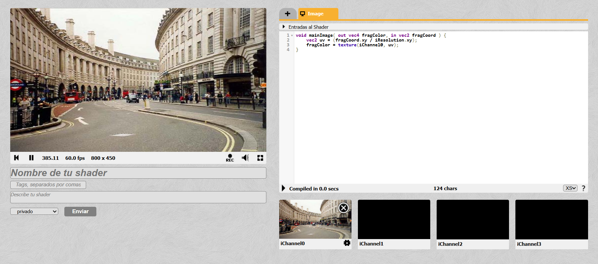

# Hit #3: Renderizado Básico de Texturas en ShaderToy

## Descripción
Este ejercicio corresponde al **Hit #3**, el cual tiene como objetivo establecer la base del procesamiento de imágenes mediante fragment shaders en ShaderToy. La tarea consiste en tomar una fuente de entrada (textura, video o cámara web) y renderizarla directamente en el lienzo de salida sin alteraciones, comprendiendo el mapeo de coordenadas UV.

---

## Instrucciones de Ejecución

Para reproducir este shader en tu entorno de ShaderToy, sigue estos pasos:

1. Ingresa a [ShaderToy](https://www.shadertoy.com/) y crea un nuevo shader.
2. En el panel inferior, dirígete a la pestaña **iChannel0**.
3. Haz clic sobre el canal y selecciona la fuente de textura deseada (se recomienda usar *Webcam* o un video de ejemplo provisto por la plataforma para ver resultados dinámicos).
4. Reemplaza el código predeterminado por el código fuente documentado en este repositorio.
5. Presiona `Alt + Enter` (o el botón de *Compile*) para visualizar el resultado en el canvas.

---

## Código Implementado

```glsl
void mainImage( out vec4 fragColor, in vec2 fragCoord ) {
    vec2 uv = (fragCoord.xy / iResolution.xy);
    fragColor = texture(iChannel0, uv);
}
```

## Explicación y Decisiones Tomadas
La lógica detrás de este shader se divide en dos etapas fundamentales, las cuales representan el flujo de trabajo estándar en procesamiento gráfico:

- Normalización del Espacio de Coordenadas (uv): ShaderToy provee las coordenadas exactas de cada píxel en la pantalla a través de la variable fragCoord. Sin embargo, para leer una textura en GLSL, es necesario operar en un espacio normalizado entre 0.0 y 1.0. Se dividió fragCoord.xy por la resolución total de la pantalla (iResolution.xy). Esto garantiza que, independientemente del tamaño de la ventana o del monitor, la esquina inferior izquierda siempre será (0.0, 0.0) y la superior derecha (1.0, 1.0).

- Muestreo de la Textura (texture): Se utilizó la función nativa texture(), pasándole como parámetros el canal de origen (iChannel0) y el vector bidimensional de coordenadas (uv) calculado en el paso anterior. Esto "lee" el color exacto (vec4 con RGBA) que corresponde a esa posición en el video/imagen de origen y lo asigna directamente al píxel de salida (fragColor).

## Capturas de Pantalla Resultados
