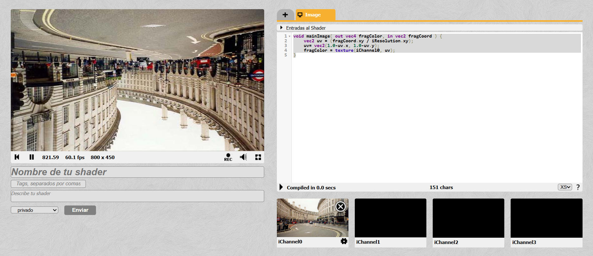

# Hit #4: Transformaciones Espaciales (Flip-Y y Flip-X)

## Descripción
Este ejercicio corresponde al **Hit #4**, donde se avanza sobre la manipulación del espacio de coordenadas UV bidimensionales. El objetivo es aplicar transformaciones espaciales básicas sobre la textura de entrada proveniente de `iChannel0`, logrando invertir la imagen de manera vertical (Flip-Y o cabeza abajo) y de manera horizontal (Flip-X o efecto espejo).

---

## Instrucciones de Ejecución

1. Ingresa a [ShaderToy](https://www.shadertoy.com/)
2. Asegúrate de tener una textura, video o la cámara web vinculada en la pestaña **iChannel0**.
3. Reemplaza el código en el editor por el script documentado debajo, el cual contiene las modificaciones matemáticas sobre el vector `uv`.
4. Compila el código (`Alt + Enter`) para observar los cambios en la orientación de la imagen.

---

## Código Implementado

```glsl
void mainImage( out vec4 fragColor, in vec2 fragCoord ) {
    vec2 uv = (fragCoord.xy / iResolution.xy);
    uv= vec2(1.0-uv.x, 1.0-uv.y);
    fragColor = texture(iChanne10, uv);
}
```

## Explicación y Decisiones Tomadas
Para lograr los efectos de "Flip", no se modificaron los píxeles de la textura de origen, sino la forma en que el fragment shader "lee" esas coordenadas.

- La lógica de la inversión (1.0 - coordenada): Como se estableció en el Hit anterior, las coordenadas uv están normalizadas en un rango de 0.0 a 1.0. Por lo tanto, si a 1.0 le restamos el valor actual, obtenemos el valor opuesto en ese eje.

- Para el Flip-Y: Se intervino exclusivamente el componente Y del vector (uv.y = 1.0 - uv.y), leyendo los píxeles de arriba hacia abajo y generando el efecto de imagen invertida verticalmente.

- Para el Flip-X: Se aplicó la misma lógica sobre el componente X (uv.x = 1.0 - uv.x), leyendo los píxeles de derecha a izquierda, lo que resulta en el clásico efecto espejo.

## Capturas de Pantalla Resultados
