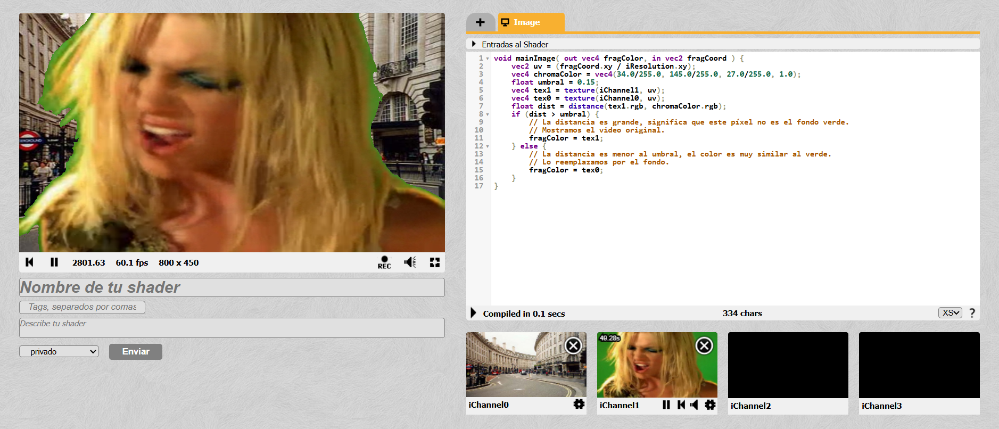
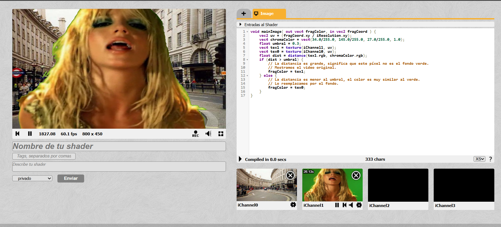
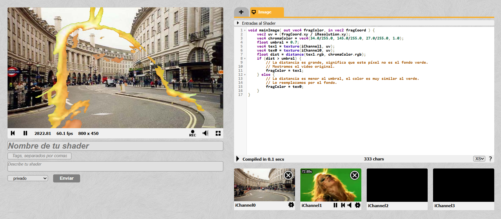

# Hit #5: Implementación de Filtro Chroma Key Básico

## Descripción
Este ejercicio corresponde al **Hit #5**, el cual introduce la combinación de múltiples canales de textura (`iChannel0` e `iChannel1`) y la manipulación condicional de píxeles basándose en cálculos matemáticos. El objetivo principal es implementar un filtro Chroma Key (pantalla verde) utilizando la distancia pitagórica en tres dimensiones para reemplazar un fondo de color específico por otra fuente de video.

---

## Instrucciones de Ejecución

1. Ingresa a [ShaderToy](https://www.shadertoy.com/) e inicializa un nuevo shader.
2. Configura los canales de entrada en el panel inferior:
   * **iChannel0:** Selecciona *Webcam* (este será el fondo dinámico).
   * **iChannel1:** Selecciona el video de ejemplo con fondo verde (Video de Britney Spears).
3. Reemplaza el código en el editor por el script documentado a continuación.
4. Modifica el valor de la variable `umbral` dentro del código para experimentar con la sensibilidad del recorte.
5. Presiona `Alt + Enter` para compilar y visualizar el resultado.

---

## Código Implementado

```glsl
void mainImage( out vec4 fragColor, in vec2 fragCoord ) {
    vec2 uv = (fragCoord.xy / iResolution.xy);
    vec4 chromaColor = vec4(34.0/255.0, 145.0/255.0, 27.0/255.0, 1.0);
    float umbral = 0.3;
    vec4 tex1 = texture(iChannel1, uv);
    vec4 tex0 = texture(iChannel0, uv);
    float dist = distance(tex1.rgb, chromaColor.rgb);
    if (dist > umbral) {
        // La distancia es grande, significa que este pixel no es el fondo verde.
        // Mostramos el video original.
        fragColor = tex1;
    } else {
        // La distancia es menor al umbral, el color es muy similar al verde.
        // Lo reemplazamos por el fondo.
        fragColor = tex0;
    }
}
```

## Explicación y Decisiones Tomadas
Para determinar si un píxel determinado pertenece al "fondo verde" que queremos eliminar, se utilizó la distancia euclidiana o pitagórica en 3 dimensiones (N=3).
La fórmula aplicada matemáticamente por la función nativa distance() de GLSL es:
d = sqrt{(R2 - R1)^2 + (G2 - G1)^2 + (B2 - B1)^2}

- Punto 1: El color actual del píxel del video en iChannel1 (tex1.rgb).
- Punto 2: El color verde ideal definido en chromaColor.rgb.
Si el resultado de esa distancia es cercano a 0, significa que los colores son prácticamente idénticos (es fondo verde). Si la distancia es grande, se trata de la figura principal (el artista) y debe conservarse.

## Análisis de Umbrales y Capturas
Al variar la variable umbral, se alteró drásticamente el comportamiento del filtro Chroma Key. 
- Valores entre 0.1 y 0.2: El algoritmo exige que el color del píxel sea casi idéntico al verde definido. Como los videos reales tienen sombras y variaciones en la iluminación de la tela, este umbral bajo no logra limpiar todo el fondo. Queda un contorno verde muy marcado alrededor de la figura principal.


- Valores entre 0.35 y 0.5: Representa el punto de equilibrio. Se absorben las diferencias de iluminación del fondo verde, logrando un recorte limpio sin comprometer los colores de la figura del primer plano.


- Valores superiores a 0.6: El algoritmo se vuelve demasiado permisivo. Comienza a eliminar píxeles del sujeto que tienen colores lejanamente similares al verde (como ciertos tonos de piel bajo iluminación específica o colores claros), creando transparencias indeseadas o "perforando" la imagen de la figura principal.
