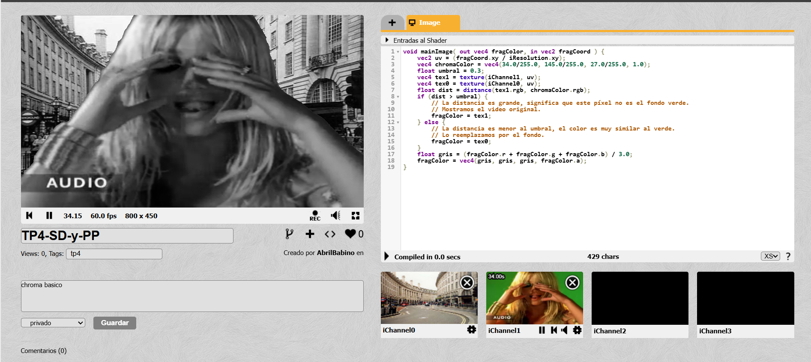

# Hit #6: Filtro de Escala de Grises (Método de Promedio Simple)

## Descripción
Este ejercicio corresponde al **Hit #6**, cuyo objetivo es integrar un filtro de escala de grises sobre la composición del Chroma Key desarrollada en el Hit #5.
---

## Instrucciones de Ejecución

1. Ingresa a [ShaderToy](https://www.shadertoy.com/) y carga el proyecto.
2. Mantén la configuración de canales: `iChannel0` (fondo) e `iChannel1` (video de primer plano con chroma).
3. Reemplaza el código en el editor por el script documentado a continuación.
4. Presiona `Alt + Enter` para compilar y observar ambos canales renderizados en escala de grises.

---

## Código Implementado

```glsl
void mainImage( out vec4 fragColor, in vec2 fragCoord ) {
    vec2 uv = (fragCoord.xy / iResolution.xy);
    vec4 chromaColor = vec4(34.0/255.0, 145.0/255.0, 27.0/255.0, 1.0);
    float umbral = 0.3;
    
    vec4 tex1 = texture(iChannel1, uv);
    vec4 tex0 = texture(iChannel0, uv);
    
    float dist = distance(tex1.rgb, chromaColor.rgb);
    
    if (dist > umbral) {
        // Asignamos el color original del primer plano
        fragColor = tex1; 
    } else {
        // Asignamos el color original del fondo
        fragColor = tex0; 
    }
    
    float gris = (fragColor.r + fragColor.g + fragColor.b) / 3.0;
    fragColor = vec4(gris, gris, gris, fragColor.a);
}
```

## Explicación y Decisiones Tomadas
- Método de Promedio Aritmético Simple:Para transformar los vectores de color a escala de grises, se utilizó la lógica matemática de promediar los tres canales (Rojo, Verde y Azul) de un píxel específico:Gris = frac{R + G + B}{3.0} 

- Optimización del Flujo de Ejecución: En lugar de procesar y convertir a escala de grises ambas texturas de entrada antes de la evaluación, primero se resuelve la estructura condicional if-else del Chroma Key para determinar qué textura (fondo o primer plano) corresponde a ese fragmento.Una vez obtenido el color definitivo, la suma y división del filtro de escala de grises se ejecuta estrictamente una sola vez al final del código.

## Capturas de Pantalla Resultados
